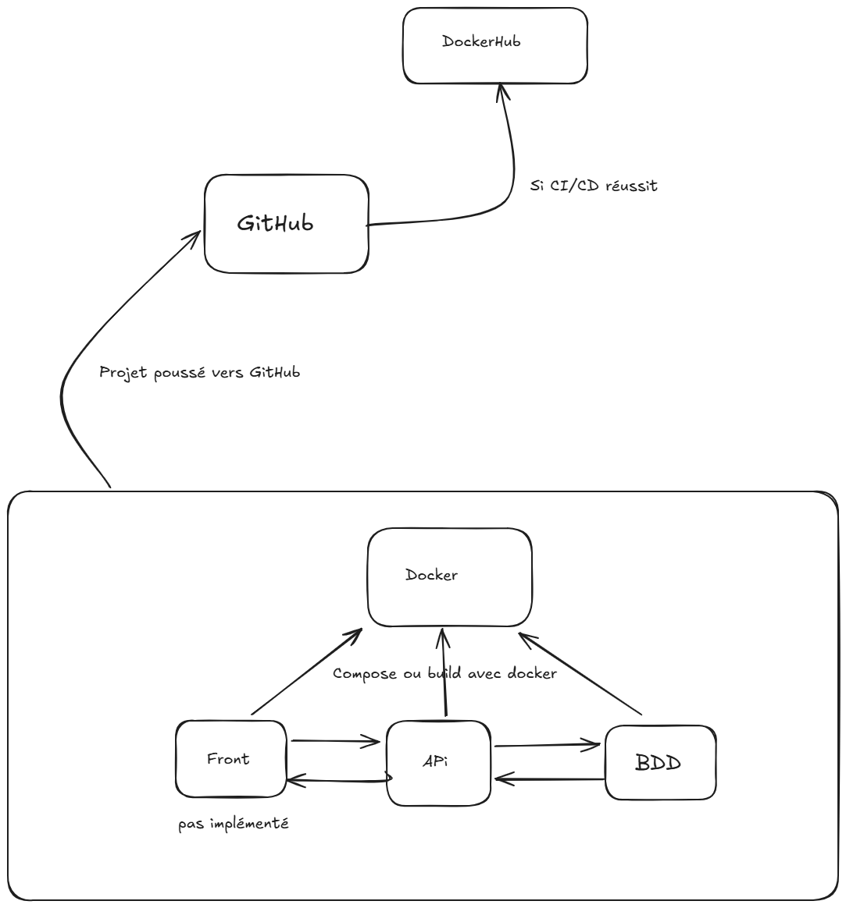

# Questions Devops

1 Comment définiriez-vous le Devops ? 

    le devops est une démarche et philosophie afin que les infras et les devs puissent communiquer 

2 Qu’impose le Devops ?

    Le DevOps impose de la curiosité (d'essayer de nouvelles choses) mais surtout de la rigueur dans son travail afin de pouvoir conserver une trace de tout et couvrir ses arrières

3 Quels sont les inconvénients ou les faiblesses du Devops ?

    Selon moi, le problème n'est pas le Devops en lui même mais plus les gens qui l'utilisent car il impose certaines valeurs (énoncées au dessus) et certains voient plus ça comme une corvée, déservant donc son utilisation.

4 Quel est votre avis sur le Devops ?

    J'aime beaucoup la philosophie Devops et ce qu'elle permet de faire. Aussi cela permet de pouvoir être autonome en tant que dev vis à vis par exemple du déploiement d'un site/app. Je pense que cela me servira dans ma vie profesionnelle et personnelle (pour le dev).

5 Quels sont les tests primordiaux pour toute application ?

    Pour une API, les tests unitaires sont primordiaux et l'implémentation d'une CI
    Pour du front, les tests Selenium sont primordiaux et l'implémentation aussi d'une CI

# Schéma explicatif DevOps


# Challenge projet :

J'ai d'abord mis en place la partie CI, docker et variables Github pour pouvoir faire les étapes avec la philosophie Dev Ops.
J'ai préféré privilégier la qualité à la quantité de travail.
Par la suite j'ai développé sur une branche "dev" et merge dans le main à chaque étape.

J'ai réalisé l'étape 1 et ses tests unitaires.

L'étape 2 a aussi été faite mais je n'ai pas eu le temps de la pousser où de faire ses tests unitaires.

Et enfin je n'ai pas fait, la partie 3 car vu le temps restant je trouvais cela plus dans la philosophie devops de réaliser l'étape 4 : Mise en production sur DockerHub.
J'ai eu le temps de la finir et on peut donc retrouver l'api faite avec cette commande ```docker pull kosmoos/quizz-devops:latest```

On peut également retrouver l'intégralité des requêtes faites avec Bruno (comme Postman) enregistrées au format Json.